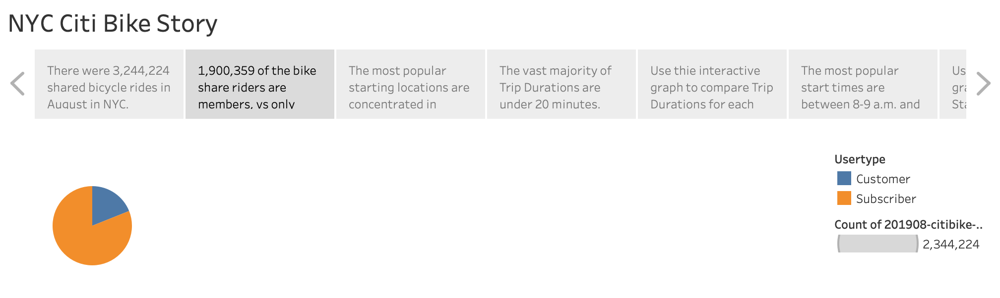
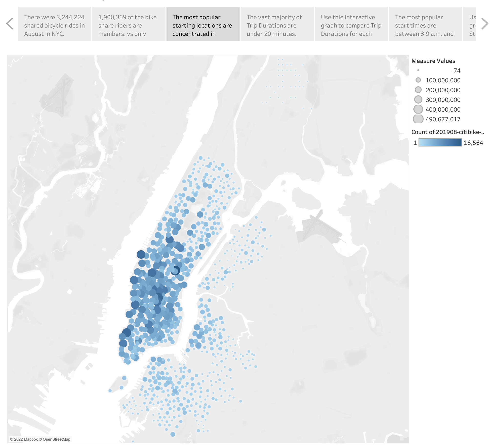
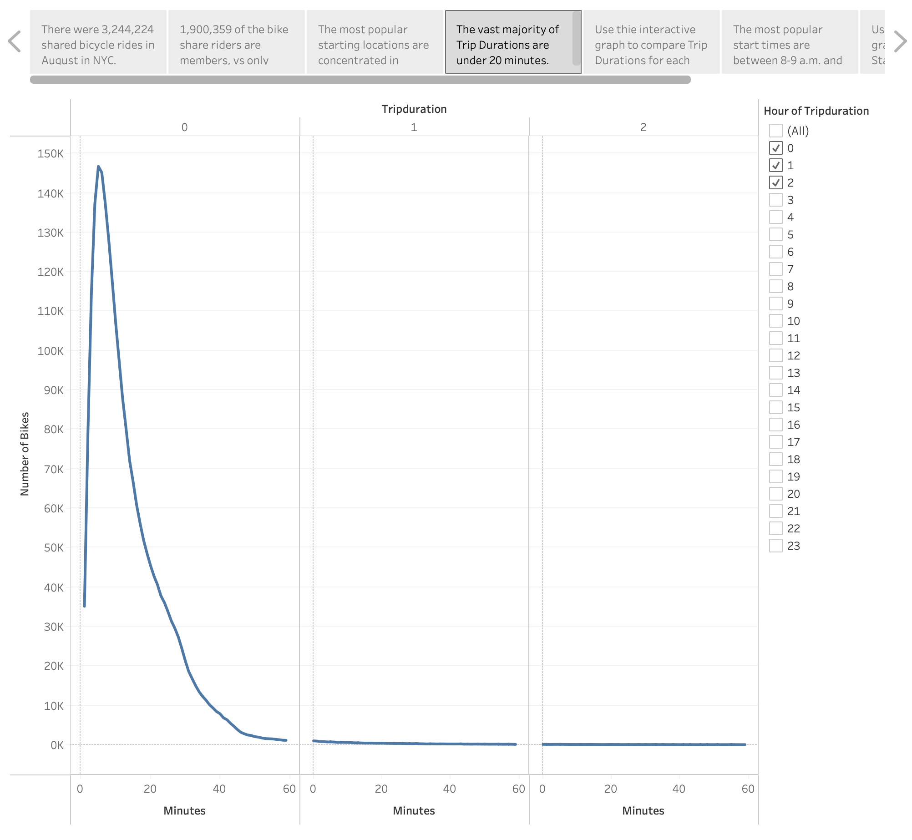
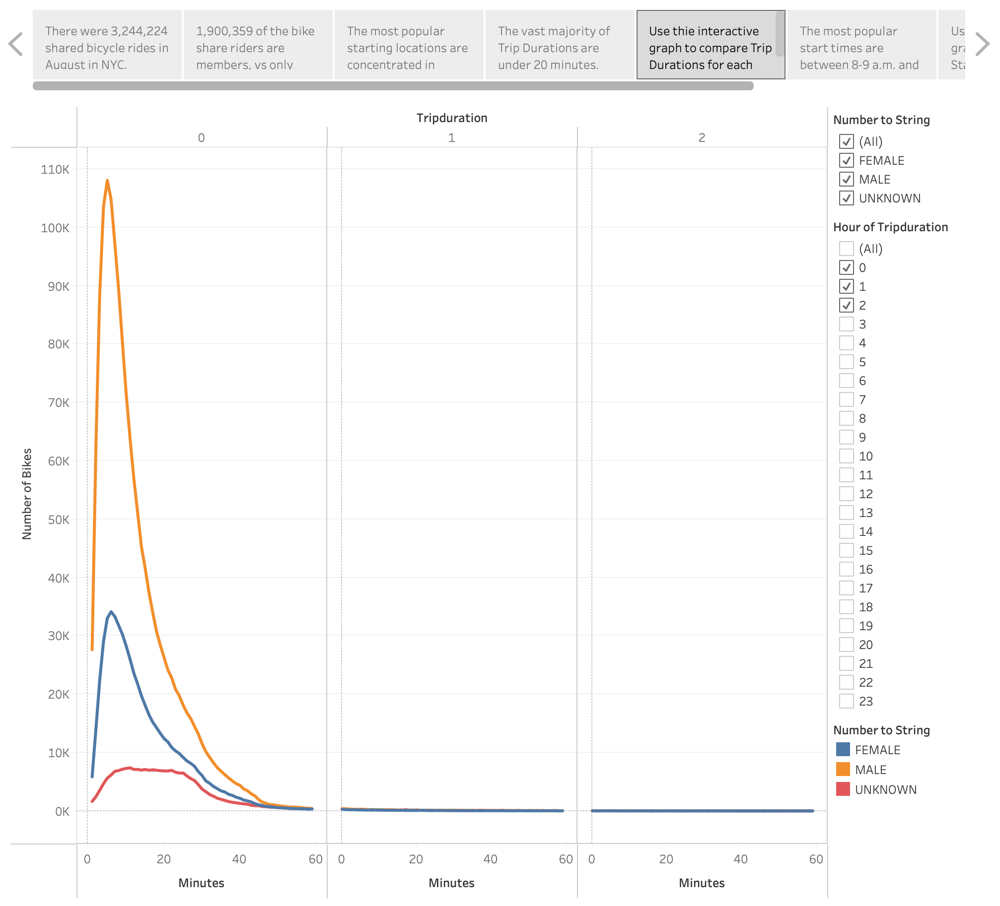
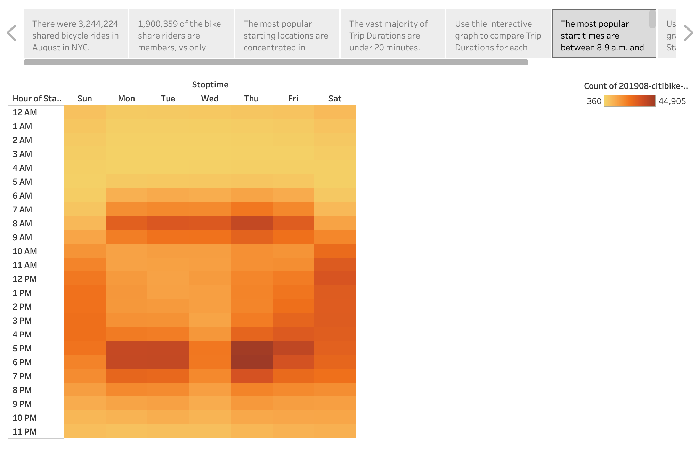
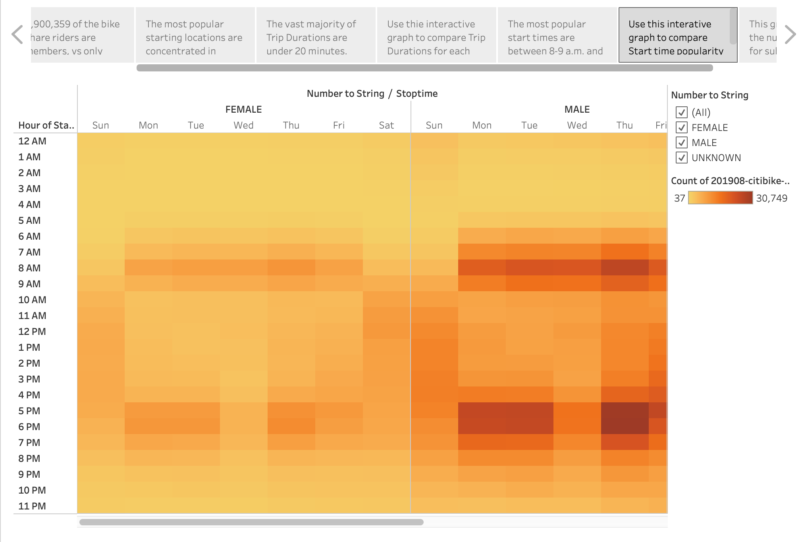
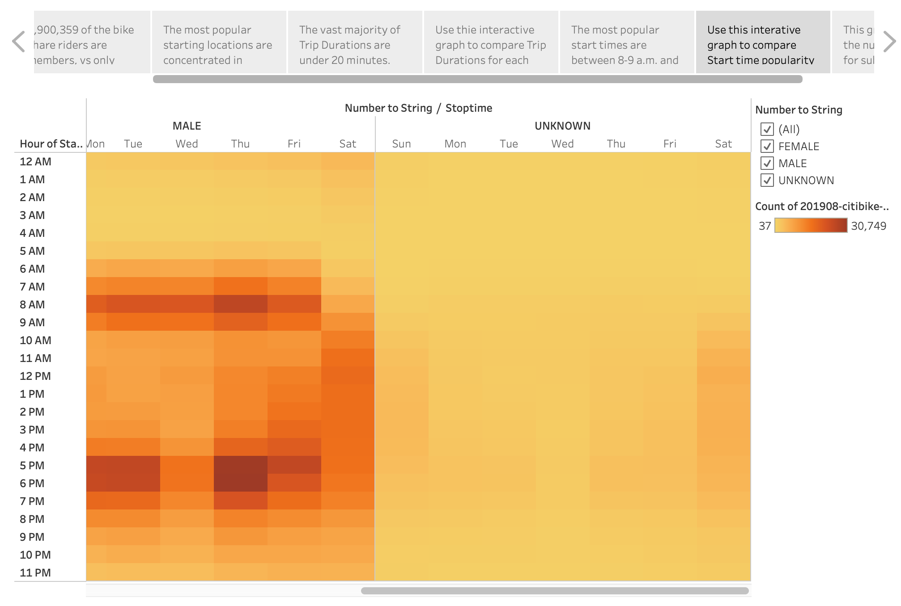
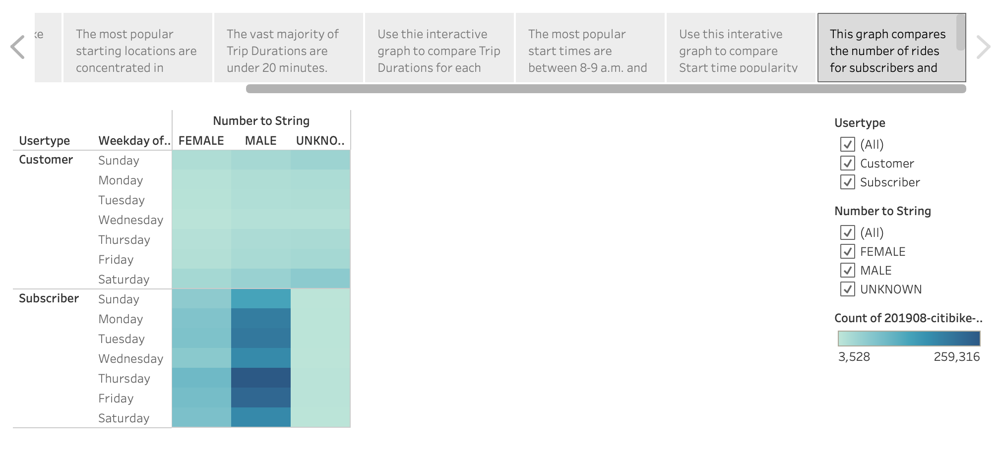

# Bikesharing

## Overview
### The purpose of the analysis is well defined 

## Results

#### View the Tableau Public Story Here: [NYC Citi Bike Story](https://public.tableau.com/app/profile/jenna.dodge/viz/NYCCitiBikeStoryJD/NYCCitiBikeStory)

### User Types

The majority (more than 3/4) of trips are taken by users who are subscribers vs single-time customers.

### Starting Locations

The most popular start locations for bike trips are focused in Manhattan.

### Trip Durations

The majority of all trips are under 20 minutes in length.

### Trip Duration by Gender

The distribution of trip duration by gender show that the majority of all trips are still less than 20 minutes, but that those of unknown gender have a slightly broader distribution of trip durations than males or females.

### Popular Starttimes

The most popular start times for week days are between 8-9 a.m. and between 5-7 p.m., whereas on the weekends there is a more even distribution of popular start times with the volume of rides being spread out from around 10 a.m. to 7 p.m.. Saturdays appeaar to be busier than Sundays, and Thursdays are the busiest week-day.

### Trips by Gender and Start Time

Analyzing the data for popular start times by gender and weekday gives us the same conclusion as above except it appears that the rides for riders of gender Unknown are concentrated on the weekends more so than the weekdays. 

### Trips by Gender and Customer Type by Start Time

Looking at the most popular days for trips categorized by customers vs subscribers we can see that the vast majority of rides are by male subscribers, mostly during the week but especially on Thursdays. There are very few rides from subscribers with unknown gender. There are very few rides from females who are customers.

## Summary

### Conclusions-
From looking at the above data visualizations we can clearly see that there are many more males who take rides on the Rideshare bikes than females, and that those rides are concentrated before and after normal working hours. This suggest that many bikeshare subscribers use the bicycles for commuting purposes. 

It is likely that those with unknown gender status are likely customers vs subscribers, and other than the sheer volume of males vs females, there doesn't appear to be a lot of difference between the data. That is, males and females (likely subscribers) have similar patterns of bike usage, which appear to be much different than those of unknown gender (likely customers).

### Recommended Further Analysis
Therefore, further exploration needs to be done into the number of rides and the trip patterns of subscribers vs customers. The following visualization suggestions would be a good starting point:
- Popular start times based on User Type (customer vs subscriber)
- Trip duration by User Type (customer vs Subscriber)